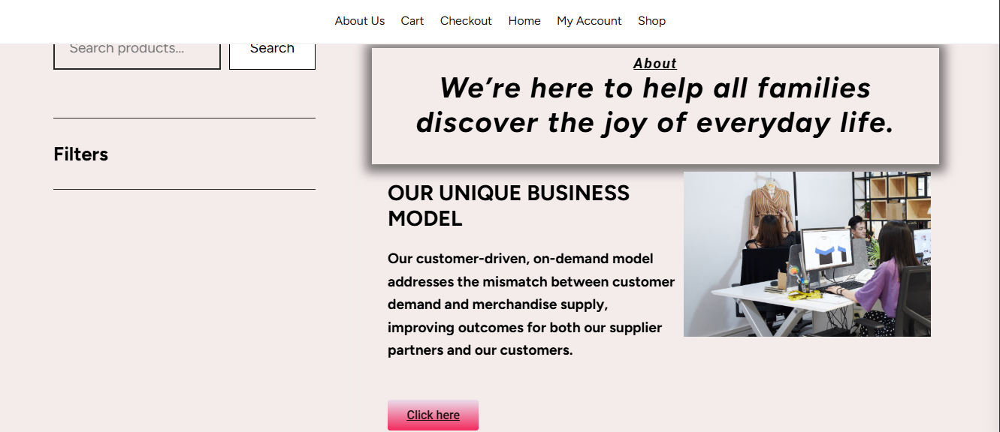
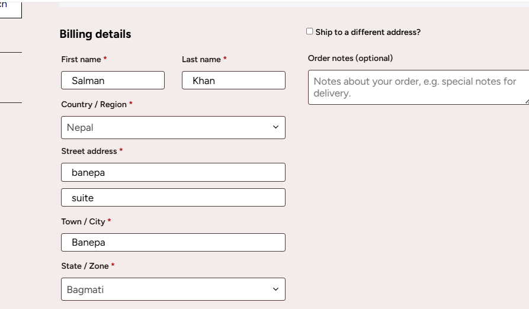
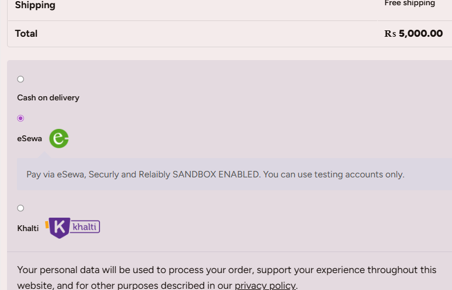
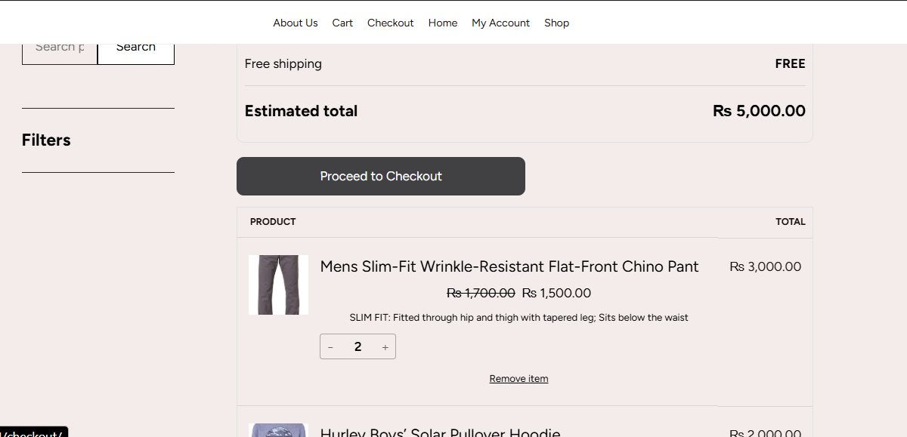

# WordPress E-commerce Website

This project was developed as a 6th semester CSIT project.

It is an e-commerce website built using WordPress and WooCommerce.

## Features
- Product listing
- Shopping cart
- Checkout system
- User login and registration
- Admin dashboard

## Technologies Used
- WordPress
- WooCommerce
- Elementor
- HTML
- CS

## Screenshots
### Homepage

### Checkout

### Shopping Cart

